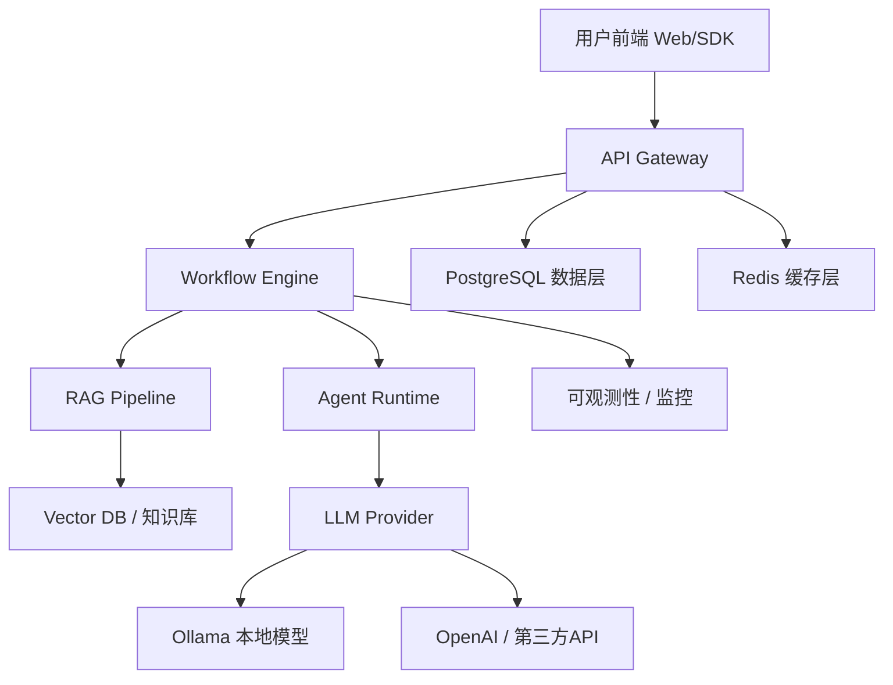
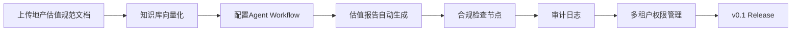
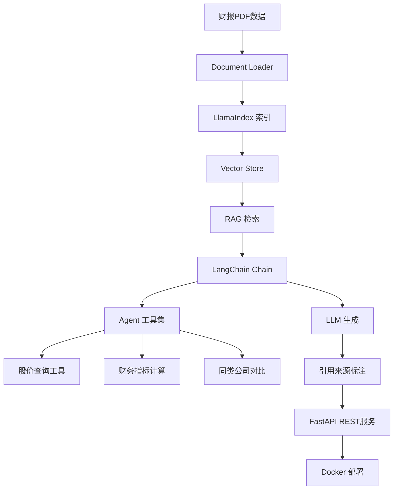
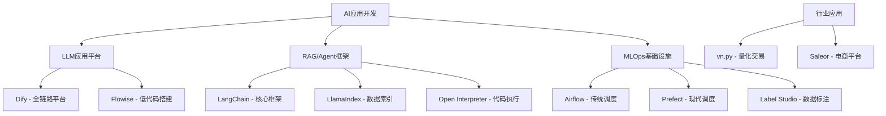

# 锚定项目部署笔记 — 苏振"能干能管"冲刺计划

**创建日期**: 2026-07-06  
**GitHub账号**: tlainee (zs@apac)  
**项目目录**: `D:\JobApply\mobT\anchor-projects`

---

## 环境基建清单

| 工具 | 版本 | 状态 | 路径/备注 |
|------|------|------|----------|
| Docker Desktop | v27.4.0 (Compose v2.31.0) | ✅ 运行中 | `C:\Program Files\Docker\Docker\` |
| Ollama | v0.31.1 | ✅ 运行中 | 已有模型 `gemma4:e4b` (9.6GB) |
| Python | v3.14.6 | ✅ 就绪 | |
| Git | v2.47.1 | ✅ 就绪 | SSH密钥 `id_github` 已配置 |
| GitHub tlainee | — | ✅ 已验证 | SSH + 浏览器双认证 |
| D盘剩余空间 | 130.58 GB | ✅ 充足 | |

---

## 项目总览

| # | 项目 | GitHub | Star数 | 技术栈 | 本地状态 | Fork状态 |
|---|------|--------|--------|--------|---------|---------|
| 1 | **Dify** | langgenius/dify | 90K+ | Python, FastAPI, PostgreSQL, Redis, Docker, K8s | ✅ 已克隆 | ✅ 已Fork |
| 2 | **LangChain** | langchain-ai/langchain | 95K+ | Python, LLM API, Vector DB | ✅ 已克隆 | ✅ 已Fork |
| 3 | **LlamaIndex** | run-llama/llama_index | 35K+ | Python, Vector DB, Document Loader | ✅ 已克隆 | ✅ 已Fork |
| 4 | **vn.py** | vnpy/vnpy | 20K+ | Python, MongoDB, Redis, WebSocket, PyQt | ✅ 已克隆 | ✅ 已Fork |
| 5 | **Flowise** | FlowiseAI/Flowise | 30K+ | TypeScript/Node.js, React, LangChain.js | ✅ 已克隆 | ✅ 已Fork |
| 6 | **Open Interpreter** | OpenInterpreter/open-interpreter | 50K+ | Python, LLM API, 代码执行沙箱 | ✅ 已克隆 | ✅ 已Fork |
| 7 | **Saleor** | saleor/saleor | 22K+ | Python, GraphQL, Django, React, PostgreSQL | ✅ 已克隆 | ✅ 已Fork |
| 8 | ~~Label Studio~~ | HumanSignal/label-studio | 18K+ | Python, Django, React, PostgreSQL | ⚠️ 克隆失败 | ✅ 已Fork |
| 9 | **Apache Airflow** | apache/airflow | 35K+ | Python, DAG, Docker/K8s | ✅ 已克隆 | — (仅Star) |
| 10 | **Prefect** | PrefectHQ/prefect | 15K+ | Python, DAG, Docker/K8s | ✅ 已克隆 | — (仅Star) |

---

## 一、Dify — 生产级LLM应用开发平台（主线 60%精力）

### 1.1 项目定位

> 完整的生产级AI系统架构，覆盖从Prompt→RAG→Agent→部署→监控全链路

### 1.2 系统架构



### 1.3 本地部署步骤

```powershell
# 1. 进入项目目录
cd D:\JobApply\mobT\anchor-projects\dify

# 2. 复制环境配置
cp docker/.env.example docker/.env

# 3. 启动全部组件（Docker Compose）
cd docker
docker compose up -d

# 4. 验证服务
docker ps
# 应看到: api, web, db, redis, nginx 等容器

# 5. 访问 Web UI
# http://localhost
```

### 1.4 接入Ollama本地模型

```
Dify Web UI → 设置 → 模型供应商 → Ollama
→ 添加模型: gemma4:e4b
→ 测试连接
```

### 1.5 地产估值助手构建路径



**关键步骤**:
1. 创建知识库 → 上传JLL地产估值规范PDF
2. 设计Workflow: 输入地块信息 → RAG检索规范 → LLM生成报告初稿
3. 添加合规检查节点: 自动校验报告是否符合监管要求
4. 加入用户权限 + 审计日志（合规要求）
5. 加入成本计量模块（展示ROI意识）

---

## 二、LangChain + LlamaIndex — 金融研报Agent（副线 40%精力）

### 2.1 项目定位

> RAG检索增强生成 + Agent工具调用链，2026年最热门AI技能

### 2.2 系统架构



### 2.3 快速启动

```powershell
# 1. 创建虚拟环境
cd D:\JobApply\mobT\anchor-projects\langchain
python -m venv .venv
.venv\Scripts\Activate

# 2. 安装核心依赖
pip install langchain langchain-openai llama-index

# 3. 基础RAG示例
python -c "
from langchain_community.document_loaders import PyPDFLoader
from langchain.text_splitter import RecursiveCharacterTextSplitter
from langchain_openai import OpenAIEmbeddings, ChatOpenAI
from langchain_chroma import Chroma

# 加载PDF
loader = PyPDFLoader('sample_report.pdf')
docs = loader.load()

# 切分
splitter = RecursiveCharacterTextSplitter(chunk_size=1000)
chunks = splitter.split_documents(docs)

# 向量化 + 存储
vectorstore = Chroma.from_documents(chunks, OpenAIEmbeddings())

# 问答
qa = vectorstore.as_retriever()
print(qa.invoke('公司营收增长情况'))
"
```

### 2.4 Agent工具集开发

```python
from langchain.agents import Tool, AgentExecutor
from langchain.tools import BaseTool

class FinancialMetricTool(BaseTool):
    name = "financial_metrics"
    description = "计算财务指标: PE, PB, ROE等"
    
    def _run(self, ticker: str) -> str:
        # 接入真实数据源或模拟数据
        return f"{ticker}: PE=15.2, PB=2.1, ROE=18.5%"

class PeerComparisonTool(BaseTool):
    name = "peer_comparison"
    description = "同类公司对比分析"
    
    def _run(self, sector: str) -> str:
        return f"{sector}行业对比报告..."
```

---

## 三、其余项目快速部署指南

### 3.1 vn.py — 量化交易平台

```powershell
cd D:\JobApply\mobT\anchor-projects\vnpy
pip install vnpy
python -m vnpy.trader.ui  # 启动GUI
```

**架构要点**: 事件驱动引擎 → Gateway抽象层 → 策略生命周期管理

### 3.2 Flowise — 可视化LLM工作流

```powershell
cd D:\JobApply\mobT\anchor-projects\Flowise
npm install
npm run build
npm run start
# 访问 http://localhost:3000
```

**架构要点**: TypeScript/Node.js后端 + React前端 + LangChain.js引擎

### 3.3 Open Interpreter — 本地代码执行Agent

```powershell
cd D:\JobApply\mobT\anchor-projects\open-interpreter
pip install open-interpreter
interpreter --local  # 使用本地Ollama模型
```

**架构要点**: LLM → 代码生成 → 沙箱执行 → 结果反馈循环

### 3.4 Saleor — Headless电商平台

```powershell
cd D:\JobApply\mobT\anchor-projects\saleor
# 使用Docker Compose部署
docker compose up -d
# 访问 http://localhost:8000
```

**架构要点**: GraphQL API + Django后端 + React前端 + Plugin系统

### 3.5 Apache Airflow — 数据工作流调度

```powershell
cd D:\JobApply\mobT\anchor-projects\airflow
# 使用Docker Compose部署
docker compose up -d
# 访问 http://localhost:8080 (admin/admin)
```

**架构要点**: DAG定义 → Scheduler调度 → Executor执行 → 监控告警

### 3.6 Prefect — 现代数据工作流

```powershell
cd D:\JobApply\mobT\anchor-projects\prefect
pip install prefect
prefect server start
# 访问 http://localhost:4200
```

**架构要点**: Python原生DAG定义 + 云原生部署 + 现代化UI

---

## 四、技术栈学习地图



### 学习优先级

| 优先级 | 技术栈 | 对应项目 | 学习资源 |
|--------|--------|---------|---------|
| P0 | RAG/Agent | LangChain + LlamaIndex | 官方文档 + 源码 |
| P0 | 生产级AI平台 | Dify | 源码拆解 + 实战 |
| P1 | 工作流调度 | Airflow / Prefect | 官方Tutorial |
| P1 | 可视化AI搭建 | Flowise | 官方Demo |
| P2 | 量化交易 | vn.py | 官方文档 + 策略开发 |
| P2 | 电商API | Saleor | Plugin开发 |

---

## 五、90天冲刺里程碑

| 阶段 | 时间 | 主线(Dify) | 副线(LangChain) | 产出 |
|------|------|-----------|-----------------|------|
| Phase 1 | Week 1-2 | 代码拆解 + Docker部署 | 学习Core Concepts | 架构笔记 + 环境跑通 |
| Phase 2 | Week 3-5 | 地产知识库 + Agent Workflow | RAG管道 + Agent工具集 | 核心功能可用 |
| Phase 3 | Week 6-8 | 多租户 + 监控 + 压测 | FastAPI + Docker化 | v1.0 Release |
| Phase 4 | Week 9-12 | 技术文章 + PR提交 | Demo视频 + README | 影响力扩散 |

---

## 六、面试讲述框架

### Prof DS岗位讲法
> "我独立设计并实现了一个基于RAG的金融研报自动生成系统。技术上解决了三个核心挑战：财报非结构化解析、幻觉问题（引用标注）、推理延迟优化（缓存层）。整个系统从数据接入到API部署独立完成。"

### DS Lead岗位讲法
> "我发现团队做金融研报分析时效率低下，从零设计了一套AI自动化方案。技术选型LangChain+LlamaIndex，架构上三层分离便于团队扩展，合规上加入审计日志和引用追溯。系统上线后团队效率提升X%。"

---

*本笔记为苏振"能干能管"就业策略的配套执行文档，所有项目链接均为有效GitHub仓库地址。*
